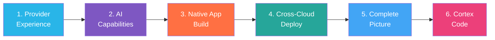
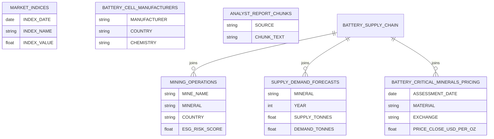
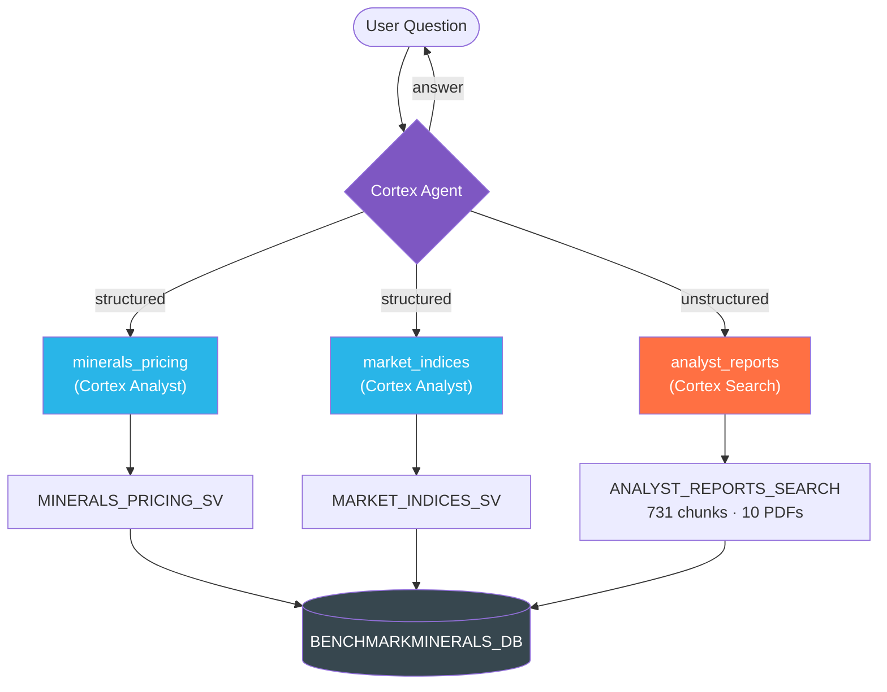
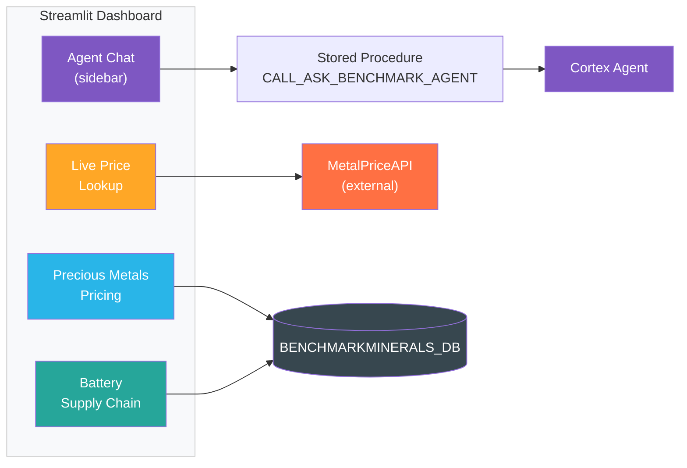
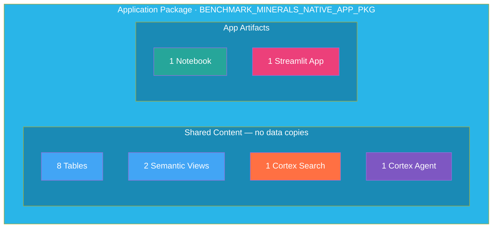
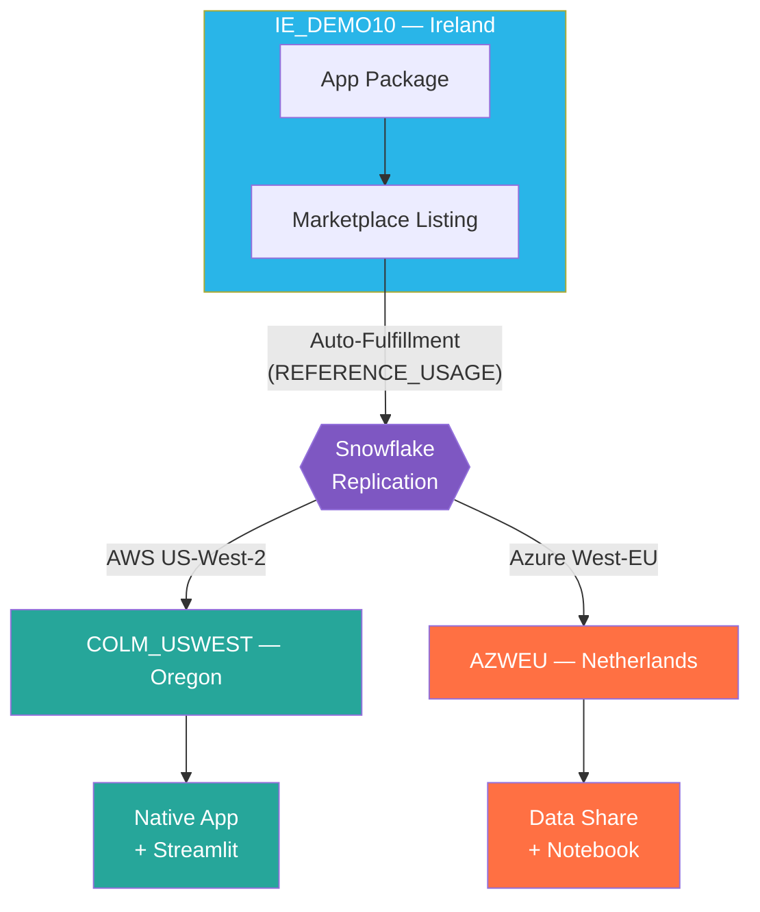
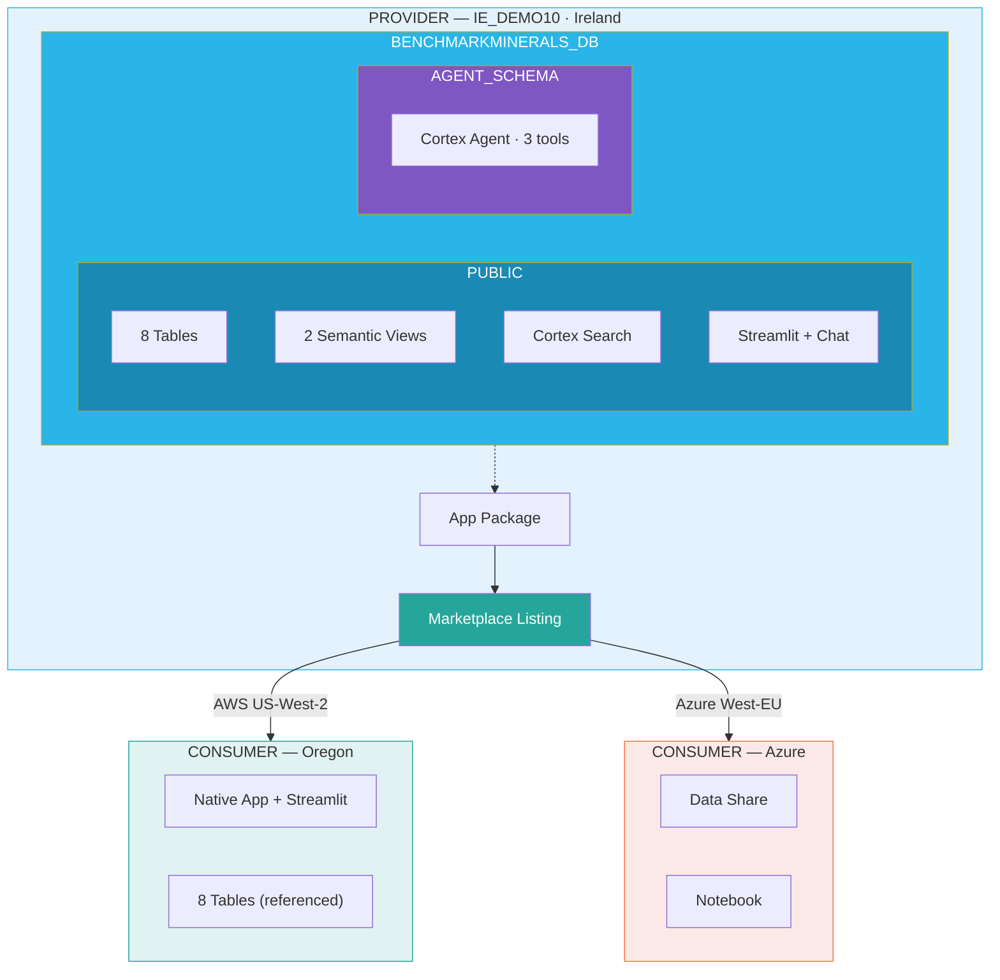
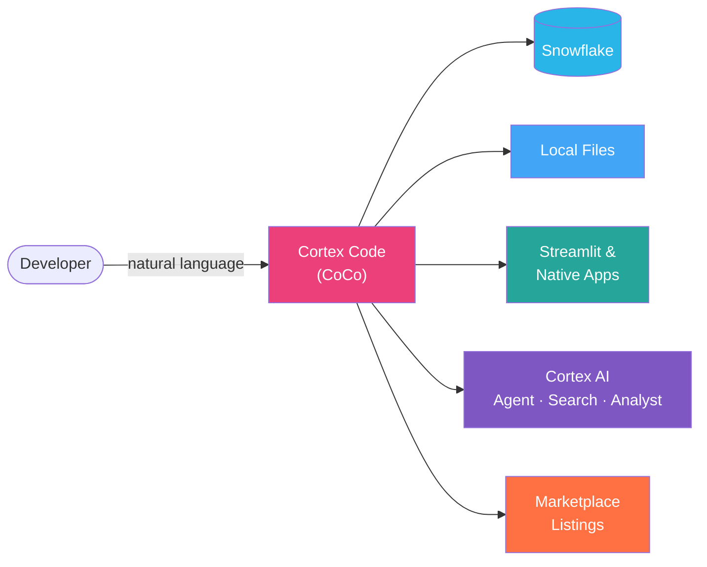
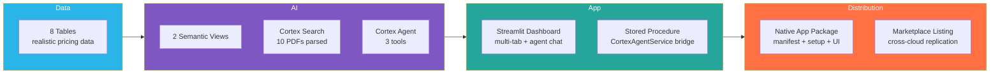

# Benchmark Minerals Intelligence — Demo Script

> **Showcasing Native Apps, Cross-Cloud Marketplace Deployment & AI Capabilities on Snowflake**

---

## Demo Overview

**Benchmark Minerals Intelligence**, a critical minerals pricing data provider, builds a complete data product on Snowflake and deploys it globally via the Snowflake Marketplace — all without moving data outside the platform. The entire project was built using **Cortex Code (CoCo)**.

**Key Themes:**
- Building Native Apps with Streamlit, Semantic Views & Cortex AI
- Publishing & deploying Marketplace listings cross-cloud (EU → US → Azure)
- AI-powered analytics with Cortex Agent, Cortex Search & Cortex Analyst
- Developer productivity with Cortex Code (CoCo) — the AI that built all of this

**Accounts Used:**

| Account | Region | Role |
|---------|--------|------|
| **IE_DEMO10** (Provider) | AWS EU-West-1 (Ireland) | ACCOUNTADMIN |
| **COLM_USWEST** (Consumer) | AWS US-West-2 (Oregon) | ACCOUNTADMIN |
| **AZWEU** (Consumer) | Azure West-EU | ACCOUNTADMIN |

### Demo Flow (~25 min)



| Time | Section | Focus |
|------|---------|-------|
| 0–3 min | Snowsight Tour | Data catalog, `BENCHMARKMINERALS_DB` |
| 3–8 min | AI Capabilities | Semantic Views, Cortex Search, Agent, Intelligence |
| 8–12 min | Streamlit App | Dashboard, agent chat, live prices |
| 12–16 min | Native App Build | Application package, manifest, declarative sharing |
| 16–20 min | Cross-Cloud Deploy | Provider Studio → Oregon → Azure |
| 20–25 min | Cortex Code | Live CoCo demo, how the project was built with AI |

---

## Act 1: The Provider Experience (IE_DEMO10)

### 1.1 Snowsight Overview
- Open **Snowsight** on IE_DEMO10
- Quick tour: Databases, Worksheets, Streamlit, Notebooks
- Show the **Catalog** — browse `BENCHMARKMINERALS_DB`

### 1.2 The Data
> "Benchmark Minerals tracks daily pricing for critical minerals — lithium, cobalt, nickel, gold, platinum and more — across global exchanges."

Navigate to `BENCHMARKMINERALS_DB.PUBLIC` and show key tables:

| Table | Description |
|-------|-------------|
| `BATTERY_CRITICAL_MINERALS_PRICING` | Daily OHLC prices across materials & exchanges |
| `MARKET_INDICES` | Market index benchmarks |
| `BATTERY_SUPPLY_CHAIN` | Supply/demand forecasts joined with mining ops |
| `MINING_OPERATIONS` | 75 mines with ESG risk scores |
| `BATTERY_CELL_MANUFACTURERS` | Cell manufacturing by country & chemistry |
| `ANALYST_REPORT_CHUNKS` | Parsed PDF analyst reports (731 chunks, 10 reports) |



---

## Act 2: AI Capabilities

### 2.1 Semantic Views — Natural Language to SQL
> "We've created Semantic Views so anyone can query our data in plain English."

- Show `BATTERY_CRITICAL_MINERALS_PRICING_SV` and `MARKET_INDICES_SV`
- Open **Cortex Analyst** and ask:
  - *"What is the latest copper price?"*
  - *"Compare lithium and cobalt prices over the last 6 months"*
  - *"Which metal had the biggest price increase this year?"*
- Show the generated SQL — Semantic Views map business terms to physical columns

### 2.2 Cortex Search — Unstructured Data
> "We have 10 analyst reports from Goldman Sachs, World Gold Council, Sprott, WPIC and others — all indexed with Cortex Search."

- Show `ANALYST_REPORTS_SEARCH` service
- PDFs parsed with `PARSE_DOCUMENT`, chunked, and indexed
- Query: *"What is Goldman Sachs' gold price forecast for 2026?"*

### 2.3 Cortex Agent — The AI Analyst
> "We've combined structured data (via Semantic Views) and unstructured data (via Cortex Search) into a single Cortex Agent."



- Show `BENCHMARK_MINERALS_AGENT` in `AGENT_SCHEMA`
- Open **Snowflake Intelligence** and interact:
  - *"What are the top 5 most expensive metals right now?"* → routes to Analyst
  - *"What is the copper price trend over the last 3 months?"* → routes to Analyst
  - *"Compare lithium and cobalt — price trend and analyst views?"* → multi-tool

### 2.4 Streamlit App with Embedded Agent
> "Our Streamlit app gives users an interactive dashboard AND an AI chat interface — all running natively in Snowflake."



- Open `BENCHMARK_MINERALS_DASHBOARD`
- Walk through:
  - **Precious Metals Pricing** — line charts, daily change heatmap, metric cards
  - **Battery Supply Chain** — supply/demand forecasts, ESG scatter, manufacturing by country
  - **"Let's Chat"** — sidebar agent chat via `CALL_ASK_BENCHMARK_AGENT`
  - **Live Price Lookup** — real-time prices via External Access Integration
- Ask the agent a question live

---

## Act 3: Building the Native App

### 3.1 Declarative Sharing
> "We share data, AI, and app as a single product. Snowflake's declarative sharing makes this possible."



- Show `BENCHMARK_MINERALS_NATIVE_APP_PKG`
- Walk through `manifest.yml`:
  ```yaml
  shared_content:
    databases:
      - BENCHMARKMINERALS_DB:
          schemas:
            - AGENT_SCHEMA:    # Cortex Agent
            - PUBLIC:          # Tables, Semantic Views, Cortex Search
  ```

### 3.2 Setup Script & Streamlit
- `setup.sql` — creates CORE schema with views over SHARED_DATA
- `streamlit_app.py` — consumer-facing dashboard, queries shared data through views

---

## Act 4: Cross-Cloud Marketplace Deployment

> "We publish once from Ireland — Snowflake handles replication everywhere."



### 4.1 Publishing (IE_DEMO10)
- Open **Provider Studio**
- Show listing: `BENCHMARK_MINERALS_APP_LISTING`
  - **Type**: External (Marketplace) · **Distribution**: Cross-region
  - **Auto-fulfillment**: `SUB_DATABASE_WITH_REFERENCE_USAGE`
- Show **Provider Profile** with company logo

### 4.2 Consumer Install (COLM_USWEST — Oregon)
- Switch to **COLM_USWEST**
- **Marketplace** → Search "Benchmark Minerals" → **Get**
- Open installed app — Streamlit dashboard with live data from Ireland
- `SELECT * FROM BENCHMARK_MINERALS_NATIVE_APP.PUBLIC.BATTERY_CRITICAL_MINERALS_PRICING LIMIT 10`

### 4.3 Data Listing (AZWEU — Azure)
- Switch to **AZWEU**
- **Catalog** → search for Benchmark Minerals data
- Open a **Notebook** to explore the shared data

---

## Act 5: The Complete Picture



### Key Talking Points

| Capability | What We Showed |
|-----------|---------------|
| **Native Apps** | Full app with Streamlit UI, setup scripts, shared data — single installable package |
| **Declarative Sharing** | Tables, Semantic Views, Cortex Search, Agent — all shared without copying data |
| **Cross-Cloud** | Published once from Ireland → auto-replicated to Oregon (AWS) and Azure |
| **Cortex Analyst** | Natural language → SQL via Semantic Views |
| **Cortex Search** | 10 analyst PDFs parsed, chunked, and searchable |
| **Cortex Agent** | Multi-tool AI analyst: structured + unstructured data |
| **Streamlit in Snowflake** | Interactive dashboard with embedded AI chat |
| **Snowflake Intelligence** | End users query the agent directly from Snowsight |
| **External Access** | Live metal prices from external API |
| **Cortex Code** | AI pair-programmer that built the entire demo |

---

## Act 6: Built with Cortex Code (CoCo)

> "Everything you've seen today was built using **Cortex Code**, Snowflake's AI-powered development CLI."

### 6.1 What is Cortex Code?



- AI pair-programmer in your terminal — understands Snowflake natively
- Direct access to your account: queries, creates objects, deploys apps, manages listings
- **Built-in skills** for Streamlit, Native Apps, Cortex Agent, Semantic Views, Dynamic Tables, and more

### 6.2 What CoCo Built for This Demo



| What | How CoCo Helped |
|------|----------------|
| **Data generation** | Realistic pricing data for 8 tables — minerals, exchanges, OHLC prices, ESG scores, manufacturers |
| **Semantic Views** | Created YAML definitions, validated, and deployed to Snowflake |
| **Cortex Search** | Parsed 10 PDFs with `PARSE_DOCUMENT`, chunked, created search service |
| **Cortex Agent** | Built 3-tool agent with orchestration instructions and sample questions |
| **Streamlit app** | Multi-tab dashboard — charts, heatmaps, agent chat, live prices |
| **Stored procedure** | `CortexAgentService` bridge (native SiS can't call Agent REST APIs) |
| **Native App** | `manifest.yml`, `setup.sql`, consumer Streamlit, full package |
| **Marketplace** | Published listing, cross-cloud auto-fulfillment, managed replication |
| **Consumer app** | Streamlit dashboard on COLM_USWEST pointing at installed native app |
| **Debugging** | Version/release channel issues, SV YAML errors, replication delays, encryption |

### 6.3 Live CoCo Demo
> "Let me show you CoCo in action."

- Open Cortex Code in the terminal
- Run live prompts:
  - *"Show me the tables in BENCHMARKMINERALS_DB"* — instant SQL
  - *"What's in the Cortex Agent?"* — describes agent config
  - *"Add a new sample question to the Streamlit app"* — edits code directly
  - *"What's the average copper price this month?"* — calls Cortex Analyst
- Key capabilities:
  - **Multi-tool orchestration** — reads files, runs SQL, writes code, deploys in one conversation
  - **Persistent memory** — remembers project context across sessions
  - **Built-in skills** — specialised workflows for every Snowflake product
  - **Iterative dev** — fix errors, re-deploy, validate without leaving the terminal

### 6.4 The Punchline
> "This entire demo — from empty account to a published, cross-cloud, AI-powered data product on the Snowflake Marketplace — was built through conversations with Cortex Code. No copy-pasting from docs. No switching between tools. Just describe what you want, and CoCo builds it on Snowflake."

---

## Appendix: Sample Questions for Live Demo

**Structured Data (Cortex Analyst):**
1. What is the latest copper price?
2. Compare lithium and cobalt prices over the last 6 months
3. Which metal had the biggest price increase this year?
4. What are the top 5 most expensive metals right now?
5. Show me the copper price trend over the last 3 months

**Unstructured Data (Cortex Search):**
1. What is Goldman Sachs' gold price forecast for 2026?
2. What does the World Gold Council outlook say about gold demand?
3. What is the platinum market outlook from WPIC?
4. Summarise the key risks highlighted in the Sprott gold outlook
5. What are analysts predicting for copper and precious metals prices this year?

**Multi-Tool (Agent):**
1. Compare copper and lithium prices over the last 6 months
2. How has nickel performed and what's the supply outlook?
3. What is the copper price trend and how does it compare to cobalt?
